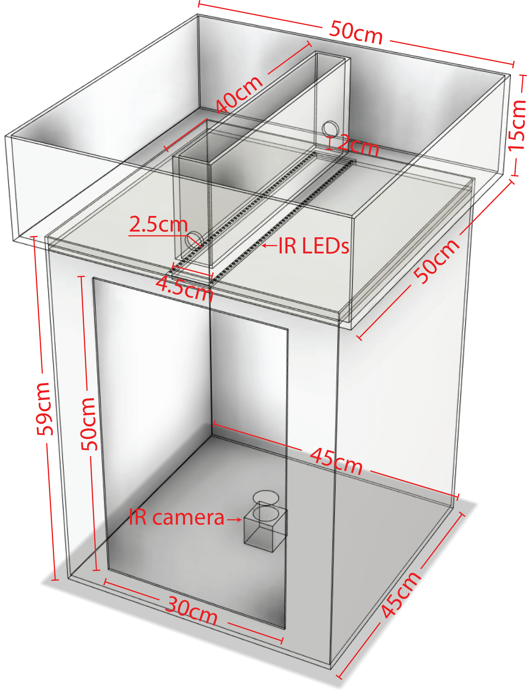
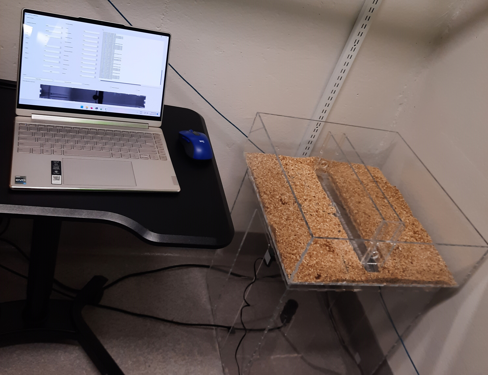

# Walkway - motion detector

Capture high frame rate videos of a custom-made, CatWalk like setup for mice using a FLIR's BlackFly camera.
A video is saved to disk whenever motion is detected and if locomotion satisfies the criteria defined in the configuration (e.g. ignoring brief periods of locomotion).

See related resources:
- [Annotation Software][annotator]
- [Paper][paper]

## Installation
* Install [Spinnaker SDK][SpinView]
* Install [Python version 3.8][Python38] (notice that the only supported Python version is 3.8).
* Open `cmd`
* Run `pip install walkway` or `python -m pip install walkway`.

## Usage overview
* Power on IR light source.
* Plug in camera to computer.
* Adjust camera settings using SpinView (optional)
	- Adjust camera aperture and focus to view region of interest under the light conditions expected during the experiment.
	- Adjust image format to limit the view to the apparatus' walkway. Note that some parameters can only be changed when acquisition is off.
* Open `cmd`
* Run `python -m walkway.capture` to start auto-triggering.
* Press `q` on the GUI or `ctrl+c` on the command window when done.
* Video files are saved to cmd's working directory (defaults to `C:/Users/<your username>` in Windows). You may `cd` to a different directory prior to start capturing to save videos elsewhere.
* You may use a configuration file in JSON format with `python -m walkway.capture --configuration configuration.json`; this will override any parameters previously set to the camera.
* Run `python -m walkway.capture --help` for more information.

* Run `python -m walkway.gui` to open a GUI with a single camera.
* Run `python -m walkway.experiment` to open an experiment with two FLIR cameras and a Petteron microphone.

# Walkway - data analysis scripts
MATLAB scripts to analyze data collected with the Walkway setup.

See related resources:
- [Data Acquisition Software][acquisition]
- [Annotation Software][annotator]
- [Paper][paper]

## Prerequisites
- [MATLAB][MATLAB] (last tested with R2023a)

## Installation
- Install MATLAB
- Download and extract these scripts to Documents/MATLAB folder.

## Usage
To export a table with gait metrics:
- Create a new data loader to match your DLC data columns (use `loadData.m` as a reference).
- Edit `process.m` according to your experimental setup and run.

For further analysis, such as replicating those described in the paper [paper], also modify `paper.m` and `preprocess.m`.

Make sure to run `startup.m` every time you restart MATLAB to add dependencies to MATLAB's search path.

## Expected configuration
- For the data loader associated to the paper, DLC files are expeected to be saved in the following format:
`[Sex][GroupId][MouseId]-[Mode][Year][Month][Day][Hour][Minute][Second][Microsecond]`
For example: `F0203-T20220124110229988302`
Sex: 1 character encoding sex: *M* or *F*
GroupId: 2-digit number (e.g. 01)
MouseId: 2-digit number (e.g. 02).
Mode: 1 character encoding recording mode, T: automatic trigger, C: manual trigger.
Year: 4-digit number (e.g. 2023)
Month, Day, Hour, Minute, Second: 2-digit number.
Microsecond: 6-digit number.

For group testing, where multiple animals may trigger detection, MouseId can be omitted from the filename:
`M02-C20220128162425752937`

# Walkway - apparatus manufacturing instructions
CAD files and assembly instructions for a Walkway apparatus.

See related resources:
- [Data Acquisition Software][acquisition]
- [Annotation Software][annotator]
- [Paper][paper]

## Components
- [6mm clear acrylic sheets](https://www.polymershapes.com/product/acrylic/)
- [Strip of 30+ LEDs](https://www.digikey.ca/en/products/detail/inspired-led-llc/12V-MB-PW-12M/5866486)
- [LED connector](https://www.digikey.ca/en/products/detail/inspired-led-llc/3496/5866456)
- [Power supply](https://www.digikey.ca/en/products/detail/sl-power-electronics-manufacture-of-condor-ault-brands/ME30A1203F01/5400157)
- [Female DC barrel jack adapter](https://www.digikey.ca/en/products/detail/sparkfun-electronics/PRT-10288/6163697)
- [Power cord](https://www.digikey.ca/en/products/detail/cui-devices/AC-C13-JP/3479178)
- Two-wire cable

## Build instructions
- Laser cut the acrylic sheets using the [provided CAD drawings](CAD). Remove protective film.
- Use 2 part epoxy to place the LED strips facing up as shown in the diagram above.
- Connect the LED strip to the LED connector -making sure to match the polarity and attach it to the narrow space of the LED holder.
- Connect positive and negative sides of the LED connector to the positive and negative sides of the DC adapter (respectively). Optionally, add a 50 to 200 Ohm resistor in series with one of the two LED cables to dim the lights.
- Assemble all acrylic parts (except removable parts) using painter's tape and apply acrylic cement or 2-part epoxy. Remove painter's tape after drying.

## Usage
- Insert removable.
- Place the mouse in the cage.
- Close the lid and power on the LEDs.

## Changelog
See [Changelog](CHANGELOG.md)

## License
© 2021 [Leonardo Molina][Leonardo Molina]

### License for the aparatus and CAD files
[Creative Commons BY-NC-SA 4.0 License](https://creativecommons.org/licenses/by-nc-sa/4.0/).

### License for the source code
[GNU GPLv3 License][LICENSE].

[Leonardo Molina]: https://github.com/leomol
[MATLAB]: https://www.mathworks.com/downloads/
[LICENSE]: https://github.com/leomol/walkway/blob/master/LICENSE.md
[SpinView]: https://www.flir.ca/products/spinnaker-sdk/
[Python38]: https://www.python.org/downloads/

[annotator]: https://github.com/leomol/gait-marker
[paper]: https://duckduckgo.com/?q=!High+throughput+gait+acquisition+system+for+freely+moving+mice&ia=web

[acquisition]: https://github.com/leomol/walkway
[annotator]: https://github.com/leomol/gait-marker
[paper]: https://duckduckgo.com/?q=!High+throughput+gait+acquisition+system+for+freely+moving+mice&ia=web